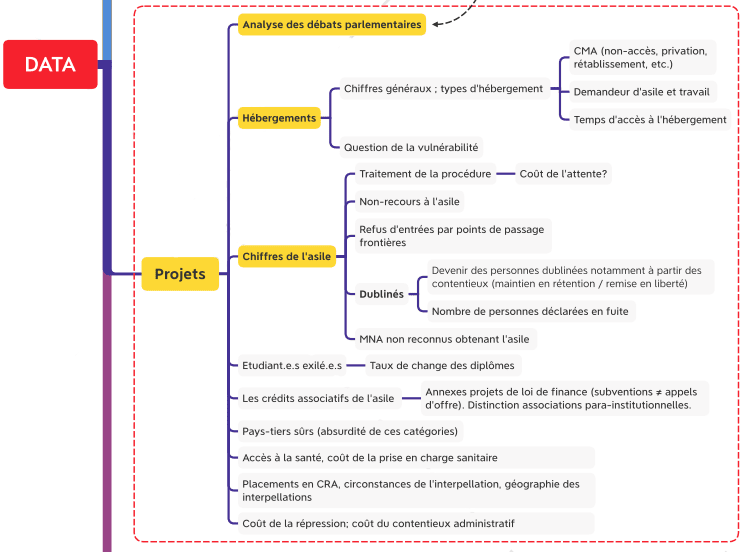

---
layout: default
nav_order : 2
title : DATA 
has_children: true

--- 

# Le groupe DATA 

Le groupe DATA part du constat d'une difficulté  à trouver des données servant à décrire le système d'asile en France. En effet, certaines données de l'asile existent sur des plateformes (Eurostat, Progedo) mais ne sont pas toujours connues des chercheur·es qui travaillent sur le sujet. Ensuite, certaines données sont produites par l'administration ou par des associations, mais sont soit illisibles, soit gardées à l'intérieur des institutions. Enfin, certaines données ou variables qui seraient utiles pour la recherche n'existent pas encore sous une forme satisfaisante.

Dès lors, le groupe cherche à :
- mutualiser entre chercheur·es la connaissance et la compréhension des jeux de données existants
- inciter les producteurs de données (administrations et associations) à déposer leurs données dans des espaces de stockage facilement accessibles

Le groupe concentre ses efforts sur trois thèmes principaux : 
- l'hébergement des demandeurs d'asile
- les procédures de demande d'asile 
- les conditions matérielles de vie des exilé·es. 

Le groupe DATA se réunit environ tous les mois et demi, ainsi que lors des journées de travail de DATASILE.

