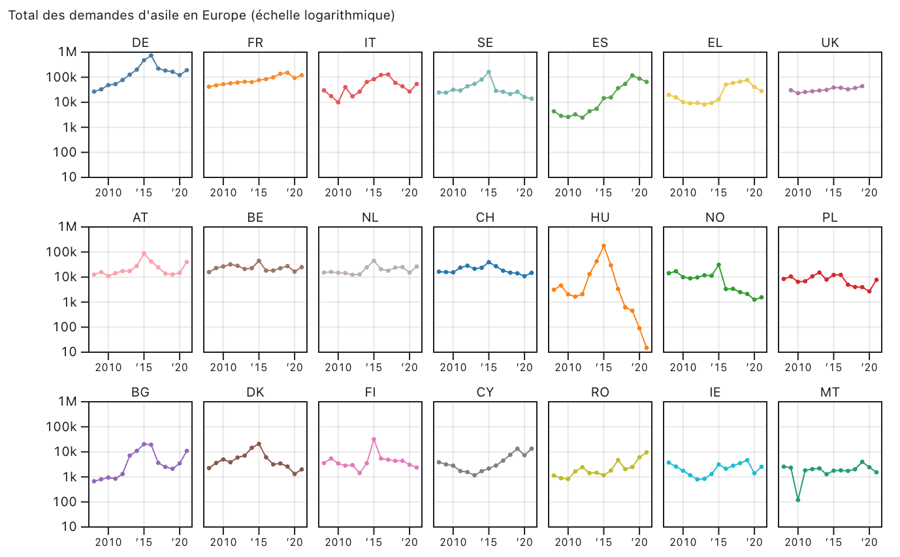
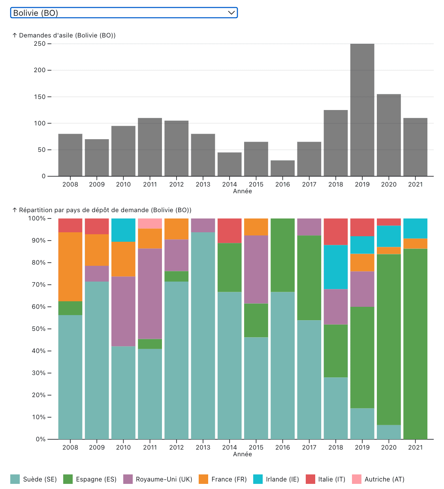

# Tutoriel eurostat: les données de l’asile

Ce tutoriel propose une méthodologie pour travailler sur des données concernant l’asile et disponibles sur Eurostat. Il se compose de trois parties:

* [Partie 1: récupérer un fichier complet de données](./tuto-eurostat-1.html)
* [Partie 2: nettoyer les données](./tuto-eurostat-2.html)
* [Partie 3: visualiser les données](./tuto-eurostat-3.html)

Dans ce tutoriel, nous verrons comment récupérer les données du site Eurostat pour produire des visualisations interactives.

